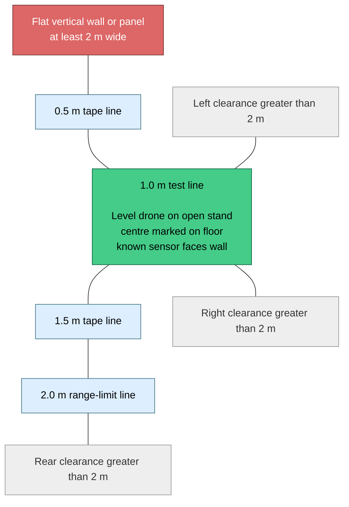
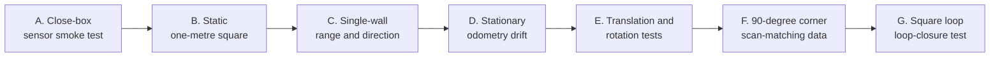

# NanoSLAM-Lite bench experiments

This guide makes the current ESP32-S3 NanoSLAM-Lite tests repeatable. It covers the props-off NUS
flight application, log capture, map rendering, pass/fail checks, and the order of the next
experiments.

The current firmware builds a live, uncorrected occupancy map from PX4 position/yaw and the eight
ToF sensors. It does **not** yet perform multi-frame scan aggregation, ICP scan matching, loop
closure, pose-graph optimization, or corrected-map regeneration. Results must therefore be treated
as sensor/projection/odometry evidence, not as finished SLAM output.

## Preserved log index

The power-source classification below is part of the experiment record. "External" means that the
ToF ring used a separate external supply; it does not refer to the ESP32-S3 USB monitor connection.

| Power condition | Log | What it records |
| --- | --- | --- |
| No external ToF supply | [`without-external-tof-power/static-1m-2026-09-08.log`](without-external-tof-power/static-1m-2026-09-08.log) | Static 1 m bench run; all 8 sensors became ready and the map reached 2,190 rays with zero dropped rays. |
| External ToF supply | [`with-external-tof-power/preflash-integrated-slam-2026-09-11.log`](with-external-tof-power/preflash-integrated-slam-2026-09-11.log) | Pre-flash integrated-SLAM image; the second boot reached 8/8 ready sensors. |
| External ToF supply | [`with-external-tof-power/camera-crash-2026-09-11.log`](with-external-tof-power/camera-crash-2026-09-11.log) | NanoSLAM-Lite bench image repeatedly panicked with `IllegalInstruction` shortly after camera initialization. |

The 2026-09-08 run is the non-external-power baseline. The two 2026-09-11 captures were explicitly
recorded with the external ToF supply. Keep new logs in the matching directory and include the date
in the filename.

## Safety and fixed configuration

- Remove the propellers and keep the vehicle disarmed.
- Keep `CONFIG_NANOLITE_BENCH_MODE=y`. Navigation and mission tasks must remain disabled.
- Put the drone on a level, non-metallic open stand that does not obstruct the downward optical-flow
  sensor.
- Use a matte, textured floor with steady lighting when evaluating optical-flow odometry.
- Do not flight-test this development image.
- Reboot the ESP32-S3 before each independent run so the graph and map receive a clean anchor.
- Change only one experimental variable at a time.

Current baseline configuration:

| Setting | Value |
| --- | ---: |
| Pose sampling | 20 Hz |
| Maximum PX4 pose age | 250 ms |
| Translation key-pose threshold | 25 cm |
| Yaw key-pose threshold | 15 degrees |
| Map | 40 x 40 cells |
| Map resolution | 50 cm/cell |
| Map coverage | 20 m x 20 m |
| Accepted ToF mapping range | 50-2000 mm |
| Reduced ToF calibration log | 1 Hz, bench mode only |
| Packed map dump interval | 10 s |
| Pose-graph capacity | 64 poses |

These values come from `sdkconfig`, `sdkconfig.defaults`, and the NanoSLAM-Lite core. Record any
configuration change with the experiment because results from different configurations are not
directly comparable.

## Recommended physical layout

For geometric tests, use a roughly 5 m x 5 m clear area so non-test objects can remain beyond the
2 m mapping gate.



Measure wall distance from the **ToF sensor face**, not from the drone centre. Photograph or sketch
the layout and mark the drone's initial heading.

## Build, flash, and capture a run

Activate the ESP-IDF environment first if `idf.py` is not already available. The validated hardware
run used ESP-IDF 6.0.2.

```bash
cd nus_flight_app
idf.py --version
idf.py build
```

Connect the PX4 telemetry link and ESP32-S3, then choose an explicit log name for the experiment:

```bash
PORT=/dev/ttyACM0
LOG=/tmp/nanolite-static-1m.log
idf.py -p "$PORT" flash
idf.py -p "$PORT" monitor 2>&1 | tee "$LOG"
```

Press `Ctrl+]` to stop the monitor. Do not disconnect or move the drone until at least one `NANOMAP`
record has appeared after the experiment. Map records are emitted every 10 seconds in bench mode.

If the firmware is already flashed, omit the `flash` command and capture a new monitor log after
resetting the board.

## Check and show the logs

From the repository root, render the latest complete map:

```bash
cd nus_flight_app
./laptop/nanolite_map_view.py /tmp/nanolite-static-1m.log
```

Extract the most useful health and mapping lines:

```bash
rg "NANOLITE BENCH MODE|read-only PX4 pose bridge|graph/map reset|8 / 8 sensors ready|RX/5s|NANOTOF|nanolite: pose|nanolite: map:|cam_hal|Apriltags" /tmp/nanolite-static-1m.log
```

In bench mode, one versioned `NANOTOF` record is emitted each second. The
`valid` mask marks returns that passed status and range reduction; `fresh`
also requires the return age to be within the mapping limit. Each sensor tuple
is `distance_mm,column,timestamp_us,age_ms`. A missing timestamp uses
`4294967295` as the age sentinel. The startup line records the sensor-ID to
body-yaw mapping used by the firmware.

When sharing a result, provide:

1. The complete monitor log, not only the ASCII map.
2. The output of `nanolite-map-view.py`.
3. Wall distances measured from the sensor faces.
4. Initial drone heading and which numbered sensor faced the reference wall.
5. Whether the drone was stationary, translated, or rotated, including measured amounts.
6. Test duration, floor type, approximate height, lighting, and anything that moved nearby.
7. Any configuration values changed from the baseline table.

### Healthy log checklist

- `NANOLITE BENCH MODE` appears; navigation and mission tasks are absent.
- `8 / 8 sensors ready` appears.
- `RX/5s` is approximately 100 position and 100 attitude messages, with both ages below 250 ms.
- `rays` increases after all ToF sensors are ready.
- `dropped=0` for an experiment contained by the 20 m map.
- Repeated returns promote `candidate` cells to `occupied` cells.
- Stable walls produce stable `NANOTOF` distances and winning columns; valid
  mapping returns normally appear in both the `valid` and `fresh` masks.
- A sensor that stops producing frames is invalidated within three seconds and
  reports a queued background recovery followed by a completion time. During
  that recovery, timestamps from healthy sensors must continue advancing; a
  failed channel must not force every valid channel out of `fresh`.
- The static observed-cell count eventually stabilizes.
- AprilTag/camera processing continues without repeated camera overflow errors.
- No sensor goes three seconds without a fresh frame, and there is no panic,
  watchdog reset, allocation failure, or repeated sensor reinitialization.

`R` and `A` in the ASCII viewer replace the underlying cell symbols. A displayed robot or anchor cell
may therefore also be occupied. Because the anchor lies at a cell boundary, very small negative pose
noise can place `R` in the cell beside `A`; this alone does not mean the vehicle moved 50 cm.

## Experiment sequence



### A. Close-box sensor smoke test — completed

Place square boundaries 0.15 m from the drone centre. This is intentionally smaller than one 0.5 m
map cell and cannot demonstrate square geometry; it only checks close-range returns in every
direction.

Baseline result from 2026-09-06:

- 8/8 sensors ready;
- 779 integrated rays after about 26 seconds;
- four observed cells and four confirmed occupied cells;
- zero dropped rays;
- zero key scans because the drone did not cross a key-pose threshold after ToF initialization; and
- AprilTag detection continued concurrently.

Status: **passed as a sensor and integration smoke test**.

### B. Static one-metre square

1. Place four flat boundaries approximately 1.0 m from the corresponding sensor faces.
2. Mark the drone centre and heading, then reboot without moving it.
3. Wait for `8 / 8 sensors ready`.
4. Record at least 30 seconds and collect at least two post-initialization `NANOMAP` records.
5. Render the final map.

Pass indicators:

- rays rise monotonically and dropped rays remain zero;
- observed and occupied cells stabilize;
- free cells appear between the drone and the walls; and
- occupied endpoints surround the drone at broadly consistent radii.

The 50 cm grid will produce a blocky, thick boundary. Do not expect accurate wall thickness or a
clean metric square from this configuration.

### C. Single-wall range and direction

Keep only one panel within 2 m; all other objects should be farther away. Run each placement from a
fresh reboot:

| Run | Wall distance | Purpose |
| --- | ---: | --- |
| C1 | 0.5 m | close valid return |
| C2 | 1.0 m | main projection baseline |
| C3 | 1.5 m | distance-dependent spread |
| C4 | 1.9 m | just inside mapping gate |
| C5 | 2.1 m | verify that an out-of-range wall creates no occupied endpoint |

Repeat the 1.0 m run with known sensor headings facing the wall. A return should rotate into the
expected world-map direction. Use the bench-only `NANOTOF` records to measure each sensor's reduced
distance, winning column, validity, timestamp, and age directly.

### D. Stationary odometry-drift test

Leave the drone fixed and level for two minutes in the one-metre setup.

Pass indicators:

- no translation or yaw key poses are added;
- `R` remains at or immediately beside `A`;
- observed-cell count stops expanding; and
- the graph does not approach its 64-pose capacity.

Any continuing trail, expanding wall thickness, or repeated key-pose creation while stationary is
evidence of pose drift, vibration, lighting problems, or optical-flow scale error.

### E. Controlled translation and rotation

Preserve the downward optical-flow view and keep the drone level.

1. Move parallel to a wall along a taped 1.0 m line, pausing at 25 cm marks.
2. Compare the reported pose increments with the floor marks.
3. Return to the start and perform a rotation about the marked drone centre.
4. Pause at 15-degree marks up to 90 degrees.

The wall should remain fixed in the world map while `R` moves or rotates. Parallel or curved copies
of the same wall indicate pose drift, an incorrect frame transform, or pose/ToF timing smear.

### F. 90-degree corner scan-matching dataset

Build a 1 m wide 90-degree corner. Capture one scan pose, then offset the drone by about 30 cm and
30 degrees and capture another. This adapts the NanoSLAM scan-matching evaluation described in the
[NanoSLAM paper, p. 17](../../../papers/2309.12008.pdf#page=17).

The current firmware can store compact eight-return key scans, but it cannot yet aggregate or match
the richer scans required for ICP. Treat this phase as dataset preparation until scan aggregation
and ICP are implemented.

### G. Square-loop and loop-closure test

Run this only after scan matching, loop-closure validation, graph optimization, and corrected-map
regeneration exist. Traverse a measured square and return to the initial position and heading. Save
both the uncorrected and corrected trajectories/maps. The correction passes when the start/end poses
and repeated walls align more closely without destabilizing the rest of the graph.

## Stop conditions

Stop a run and save the log if any of these occur:

- bench-mode confirmation is absent;
- position or attitude age repeatedly reaches 250 ms;
- fewer than eight ToF sensors initialize;
- the ESP32-S3 panics, resets, or trips a watchdog;
- camera overflows repeat continuously;
- `dropped` rises in a small, stationary test area;
- the pose graph fills during a stationary test; or
- the physical test rig moves unexpectedly.

## Next implementation steps exposed by testing

1. Seed the anchor key scan when the first complete ToF ring frame becomes available, even when the
   drone has not moved.
2. Verify and calibrate all eight sensor mounting yaw offsets and column-bearing signs using the
   rate-limited `NANOTOF` calibration records.
3. Quantify pose/ToF time offset during controlled motion.
4. Re-evaluate map resolution after projection calibration; keep 50 cm fixed while collecting the
   baseline dataset so experiments remain comparable.
5. Tune key-pose thresholds or introduce submap rollover before the 64-pose graph is used for long
   runs.
6. Implement multi-frame scan aggregation and bounded ICP.
7. Add validated loop-closure edges, sparse graph correction, and map regeneration.
8. Only then progress to props-on hover and exploration tests after a separate flight-readiness
   review.

## Run record template

```text
Date/time:
Operator:
Log filename:
Firmware revision or build hash:
ESP-IDF version:
Experiment ID:
Bench mode confirmed: yes/no
Props removed: yes/no
Layout and measured distances:
Sensor facing reference wall:
Initial heading:
Floor/lighting/height:
Motion performed:
Duration:
Final map sequence/rays:
Observed/candidate/occupied/dropped:
Pose count/key-scan count:
Camera status:
Unexpected events:
Pass/fail and reason:
```

## Related documentation

- [UREX NanoSLAM-Lite integration](../UREX_INTEGRATION.md)
- [NanoSLAM-Lite core](../components/nanolite/README.md)
